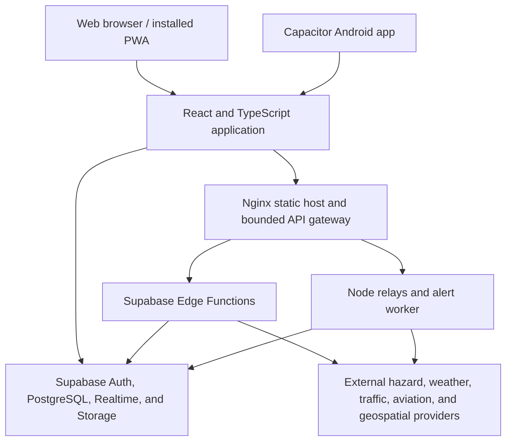

<p align="center">
  
</p>

<h1 align="center">KALASAG</h1>

<p align="center">
  A Philippines-focused disaster readiness and situational-awareness platform for live hazard monitoring, family safety, and emergency preparedness.
</p>

<p align="center">
  <a href="https://kalasagph.tech"><strong>Live application</strong></a>
  ·
  <a href="#getting-started"><strong>Run locally</strong></a>
  ·
  <a href="#architecture"><strong>Architecture</strong></a>
</p>

<p align="center">
  
  
  
  
  
  
</p>

> [!IMPORTANT]
> KALASAG supports situational awareness; it is not a replacement for PAGASA, PHIVOLCS, local government instructions, emergency services, or professional judgment. Live providers can be delayed or unavailable. Always verify urgent information with official authorities and call the appropriate emergency hotline.

## Overview

KALASAG combines public hazard feeds, map layers, weather and traffic information, emergency tools, and opt-in family location sharing in one responsive application. It runs as an installable web app and as a Capacitor-based Android app.

Operational telemetry follows a strict integrity rule: **missing live data is reported as unavailable or stale rather than replaced with simulated data**. Any development-only visualization is isolated from production builds and must be clearly labeled.


## Features

### Live hazard and conditions map

- Earthquakes and proximity warnings
- Tropical cyclone centers, observed tracks, forecasts, and alert context
- Satellite thermal observations
- Flood advisories, flood susceptibility, and contextual flood events
- Storm-surge scenarios, dams, volcanoes, and fault-line overlays
- Live aircraft positions and available route context
- TomTom road traffic flow, incidents, and reported delays
- Nearby mapped shelters, evacuation sites, parks, schools, and public facilities
- Hazard-focused news markers and optional user hazard reports
- Layer controls, legends, geolocation, safe-ground search, and light/dark themes

### Dedicated monitoring modules

- Earthquake information
- Typhoon tracker
- Current weather and seven-day forecast
- Volcano status
- Dams and water conditions
- Road traffic within a location-based monitoring radius
- Hazard-focused Philippine news feed

### Emergency readiness

- Philippine emergency hotline directory
- Emergency QR ID with medical and contact information
- Background proximity checks for selected hazards
- Installable PWA with an offline application shell
- Explicit stale, offline, and unavailable states for live feeds

### Family safety

- Create or join a family group using rotating join codes
- Host approval and member management
- Safe, assistance-needed, and danger statuses
- Danger-alert acknowledgement and delivery tracking
- Opt-in Driving Mode location sharing
- Realtime family chat with text, location, image, and video messages
- Android push and foreground-service support when Firebase is configured

> [!NOTE]
> Maritime AIS code is present, but user-facing vessel monitoring is currently disabled. KALASAG does not display fabricated vessel positions when the live service is unavailable.

## Data integrity and interpretation

Not every point on a map is a confirmed emergency:

- NASA FIRMS detections are **satellite thermal observations**, not verified structure fires.
- NASA EONET flood records are **event context points**, not inundation boundaries.
- OpenStreetMap/Overpass safe-ground results are **mapped candidates**, not guarantees that a site is open, accessible, or safe during the current emergency.
- Traffic, aircraft, weather, and hazard feeds can have provider-specific update delays.
- PWA caching keeps the interface available; it does not turn old telemetry into current telemetry.

The UI should preserve these distinctions whenever new layers or providers are added.

## Architecture



### Technology stack

| Layer | Technology |
| --- | --- |
| Web application | React 19, TypeScript, React Router |
| Build tooling | Vite 8, Oxlint, TypeScript project references |
| Styling and UI | Tailwind CSS 4, Radix UI, Lucide icons, Anime.js |
| Mapping | Leaflet, React-Leaflet, CARTO/OpenStreetMap basemaps |
| Traffic | TomTom traffic flow and incident APIs |
| Backend platform | Supabase Auth, PostgreSQL, RLS, Realtime, Storage, Edge Functions |
| Server services | Node.js relays and workers behind Nginx/systemd |
| Mobile | Capacitor 8 and native Android Java services |
| Offline support | `vite-plugin-pwa` and Workbox |

### Backend responsibilities

- `live-data` is the authenticated gateway for hazard, weather, traffic, aviation, safe-ground, and geocoding resources.
- `news-ingest` fetches and normalizes approved publisher metadata, classifies hazard-related stories, and geocodes defensible locations.
- `family-alert-dispatch` leases durable outbox jobs and sends ordered Android notifications through Firebase Cloud Messaging.
- `ais-relay` contains the bounded WebSocket implementation for maritime telemetry, although the corresponding UI feature is disabled.
- VPS services provide bounded cyclone/news relays and family-alert polling without exposing provider credentials to browsers.

## Project structure

```text
KalasagPH/
├── src/                    React application and client data adapters
│   ├── components/         Dashboard, monitoring modules, and shared UI
│   ├── components/hazards/ Hazard map layers and baseline configuration
│   ├── data/               Live data normalization and client models
│   ├── hooks/              Auth, family safety, news, network, and theme state
│   ├── lib/                Supabase, geolocation, safety, and shared utilities
│   └── pages/              Public website pages
├── supabase/
│   ├── functions/          Deno Edge Functions
│   └── migrations/         Versioned schema, RLS, RPC, and cron changes
├── server/                 Long-running Node relays and workers
├── android/                Capacitor Android project and native services
├── deploy/
│   ├── nginx/              Static hosting and reverse-proxy configuration
│   └── systemd/            Hardened Linux service units
├── scripts/                Validation, security, provider, and data tools
├── public/                 PWA assets and generated public datasets
├── docs/research/          Source-backed implementation research
├── sql/                    Historical/bootstrap SQL; migrations are authoritative
└── instruction.md          Detailed VPS deployment and operations runbook
```

## Getting started

### Prerequisites

- Node.js 20 or newer
- npm
- A Supabase project for authentication, database, Realtime, Storage, and Edge Functions
- Optional provider credentials for live traffic, AIS, and vessel enrichment
- Android Studio and a compatible JDK only when building the Android app

### 1. Install dependencies

```bash
npm install
```

### 2. Configure the environment

Copy the example configuration into a local ignored file:

```bash
cp .env.example .env.local
```

PowerShell equivalent:

```powershell
Copy-Item .env.example .env.local
```

Minimum browser configuration:

```dotenv
VITE_SUPABASE_URL=https://your-project.supabase.co
VITE_SUPABASE_ANON_KEY=your-publishable-or-anon-key
```

Common optional browser settings:

| Variable | Purpose |
| --- | --- |
| `VITE_LIVE_DATA_URL` | Production HTTPS gateway for live-data requests; defaults to the Supabase function when omitted |
| `VITE_ADDRESS_SEARCH_URL` | Production HTTPS address-search gateway |
| `VITE_AIS_RELAY_URL` | Optional secure AIS relay URL; maritime UI remains disabled by default |
| `VITE_HAZARD_REPORTING_ENABLED` | Enables the optional user hazard-reporting interface when set to `true` |
| `VITE_APP_VERSION` | Version recorded with Android push registrations |
| `VITE_FLOOD_HAZARD_TILE_URL` | Optional replacement flood-hazard tile endpoint |
| `VITE_STORM_SURGE_TILE_URL` | Optional replacement storm-surge tile endpoint |

Provider credentials are server-side values. Do **not** prefix them with `VITE_`:

| Server-only variable | Purpose |
| --- | --- |
| `TOMTOM_API_KEY` | Traffic flow, incidents, and traffic tiles |
| `AISSTREAM_API_KEY` | AIS relay connection |
| `GFW_API_TOKEN` | Vessel identity enrichment |
| `NEWS_INGEST_SECRET` | Authenticates trusted news-ingestion requests |
| `SUPABASE_SERVICE_ROLE_KEY` | Trusted worker/administrative operations only |

Never commit `.env`, `.env.local`, service-role keys, Firebase service-account material, database URLs, relay secrets, or provider credentials.

### 3. Start the development server

```bash
npm run dev
```

Open `https://localhost:5173`. The development server uses a local HTTPS certificate, so a browser may ask you to trust it.

To test from another device on your LAN deliberately:

```bash
npm run dev -- --host 0.0.0.0
```

Keep LAN exposure temporary and configure `KALASAG_DEV_ALLOWED_HOSTS` and `KALASAG_DEV_ALLOWED_ORIGINS` rather than weakening origin checks.

### 4. Verify the project

```bash
npm run lint
npm run build
npm run security:check
```

Run the complete local verification chain before opening a pull request:

```bash
npm run verify
```

Network-dependent provider and release checks require working environment configuration:

```bash
npm run services:check
npm run release:check
```

There is currently no conventional `npm test` script. Behavioral safeguards are implemented as focused check scripts under `scripts/` and composed by `npm run verify`.

## Useful commands

| Command | Purpose |
| --- | --- |
| `npm run dev` | Start the local HTTPS Vite server |
| `npm run build` | Type-check and create the production `dist/` build |
| `npm run preview` | Preview a completed production build locally |
| `npm run lint` | Run Oxlint |
| `npm run verify` | Run lint, focused checks, production build, and security scan |
| `npm run security:check` | Scan source/configuration for security regressions |
| `npm run security:audit` | Run the production dependency audit |
| `npm run services:check` | Probe configured live providers |
| `npm run start:storm-relay` | Start the bounded cyclone relay |
| `npm run start:news-source-relay` | Start the approved publisher-feed relay |
| `npm run start:family-alert-worker` | Start the trusted family-alert dispatcher worker |
| `npm run start:ais-relay` | Start the standalone AIS relay implementation |

See `package.json` for the complete list of schema, hazard, freshness, family-safety, news, and data-generation checks.

## Android development

The Android application packages the same production web build from `dist/`.

```bash
npm run build
npx cap sync android
```

Then open `android/` in Android Studio, or build from the Gradle wrapper:

```powershell
cd android
gradlew.bat assembleDebug
```

Firebase configuration is optional at build time. Without a valid local `android/app/google-services.json`, the app builds with push registration disabled. Never commit that file unless the Firebase project is intentionally configured for public client distribution and its contents have been reviewed.

## Production deployment

Production is a static Vite deployment with supporting services:

1. Build with `npm run build`.
2. Serve `dist/` through Nginx using the configurations in `deploy/nginx/`.
3. Deploy Supabase migrations and the required Edge Functions separately.
4. Run long-lived relays/workers using the hardened units in `deploy/systemd/`.
5. Execute `npm run release:check` against the configured production endpoints.

Do **not** run `vite`, `npm run dev`, or `npm run preview` as the production web service. The full deployment and rollback procedure is documented in `instruction.md`.

## Privacy and security

KALASAG handles sensitive data and device capabilities. Contributors should understand these boundaries before changing related features:

- Emergency QR IDs contain plaintext medical and contact information that anyone with the QR image can read.
- Driving Mode can share precise location, accuracy, heading, speed, and timestamps with approved family members.
- Family chat is protected by database policies and private signed media URLs, but it is not end-to-end encrypted by this codebase.
- Weather, traffic, geocoding, and safe-ground requests may send coordinates to their respective upstream providers through the live-data gateway.
- Android may request foreground/background location, notifications, and reboot handling to restore an explicitly active Driving Mode session.
- Push notifications are best-effort and can be delayed by connectivity, permissions, Do Not Disturb, force-stop, or manufacturer battery restrictions.
- Browser-visible Supabase publishable/anonymous keys are protected by correct Row Level Security; service-role and provider keys must remain server-side.

Before publishing a build or repository snapshot, run:

```bash
npm run security:check
npm run security:audit
```

Also inspect generated archives, APKs, logs, and local build artifacts before adding them to version control; opaque binaries cannot be fully reviewed by source-level secret scanners.

If you discover a security issue, report it privately to the project maintainer rather than opening a public issue containing exploit details or sensitive data.

## Live data providers and attribution

KALASAG integrates data or map services from sources including:

- [PAGASA](https://www.pagasa.dost.gov.ph/) and GeoRiskPH for selected Philippine weather, dam, flood, and storm-surge products
- [USGS Earthquake Hazards Program](https://earthquake.usgs.gov/) for earthquake events
- [GDACS](https://www.gdacs.org/) for cyclone and disaster alert context
- [NASA EONET](https://eonet.gsfc.nasa.gov/) for contextual natural-event records
- [NASA FIRMS](https://firms.modaps.eosdis.nasa.gov/) for VIIRS thermal observations
- [Open-Meteo](https://open-meteo.com/) for weather forecasts
- [TomTom](https://developer.tomtom.com/) for road traffic flow and incidents
- [Airplanes.live](https://airplanes.live/) and related ADS-B services for aviation telemetry and route context
- [OpenStreetMap](https://www.openstreetmap.org/copyright), [Photon](https://photon.komoot.io/), Overpass, and [CARTO](https://carto.com/) for basemaps, search, geocoding, and mapped-place discovery
- Approved Philippine news publishers for article metadata and source links

Each provider retains ownership of its data and may impose separate attribution, caching, rate-limit, and usage requirements. Review provider terms before changing how data is stored, proxied, redistributed, or displayed.

## Contributing

1. Create a focused branch for your change.
2. Keep changes small and consistent with existing patterns.
3. Never substitute simulated telemetry for missing live operational data.
4. Add or update focused checks when behavior changes.
5. Run `npm run verify`.
6. Document new environment variables, permissions, providers, and deployment changes.
7. Open a pull request describing the user impact, data source, failure behavior, and validation performed.

When adding a live provider, define:

- what the source actually measures
- expected freshness and geographic coverage
- unavailable/stale behavior
- attribution and licensing requirements
- credential placement and request limits
- whether the data is observational, modeled, reported, or officially verified
